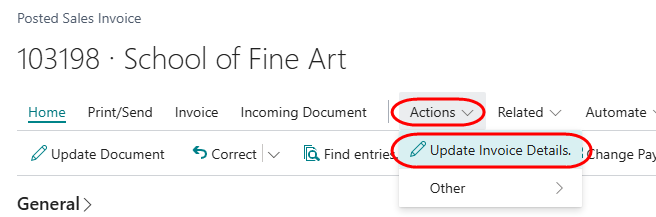

# Modify non-financial details on posted sales documents
This function allows you to modify information which does not have a financial impact on posted sales invoices or credit memos.

Open a posted sales invoice or posted sales credit memo.
Select the menu option Actions -> 

