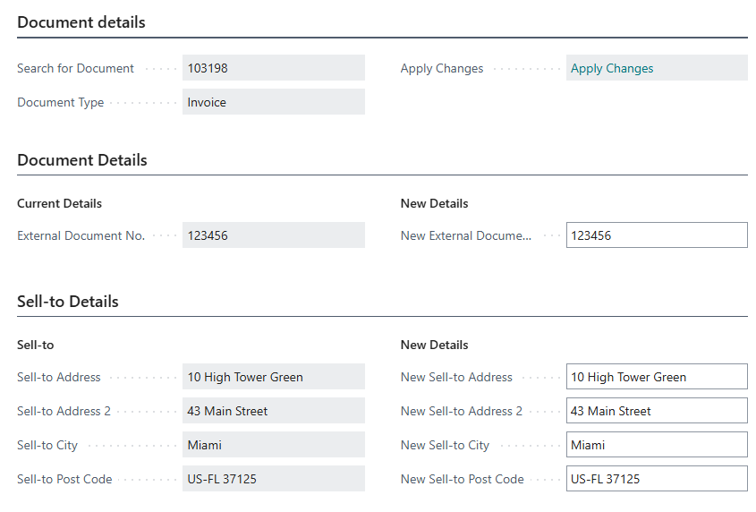
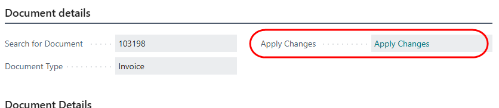

# Modify non-financial details on posted sales documents
This function allows you to modify information which does not have a financial impact on posted sales invoices or credit memos.

These include:
- External document number
- Sell-to address details
- Bill-to address details

Open a posted sales invoice or posted sales credit memo.
Select the menu option Actions -> **Update Invoice Details**

The Document page opens.

The left hand side of each section displays the existing details
The right hand side contains editable fields.

Edit the details as required.

To save your changes, click on 'Apply Changes'.

Address changes are applied to the document.
Changes to the External Document number are applied to:
- Posted Document
- Customer ledger entry
- General ledger entries
- Inventory entries
