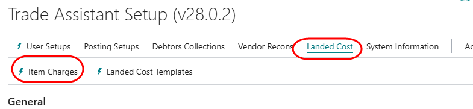
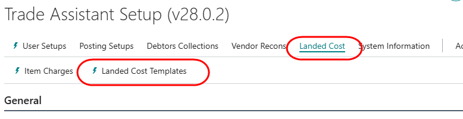
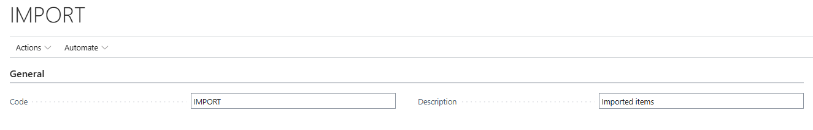
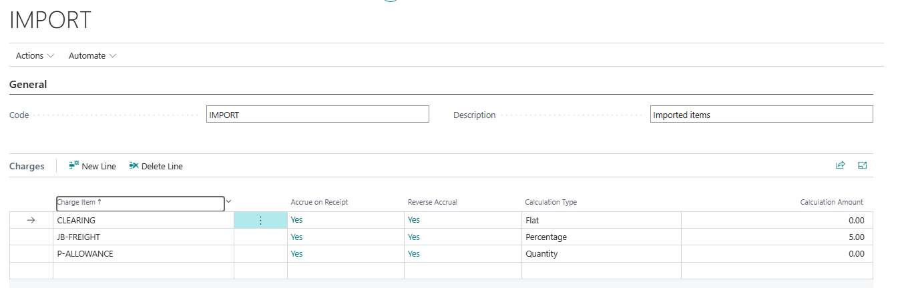

# Landed Cost - Configuration and Setup

- [Item Charges](#item-charges)
- [Landed Cost Templates](#landed-cost-templates)
- [Attach landed costs to items](#attach-landed-cost-templates-to-items)

### Item Charges
Supplementary costs are defined under the Item Charges table. The table allows you to specify a preferred supplier for each defined charge. :

From the Trade Assistant Setup page, select Landed Cost -> Item Charges

  

  

### Landed Cost Templates
Landed cost templates are used to define groups of item charges that should be applied to when buying certain products. After definition, the template can be attached to an item, or added on a purchase line.

From the Trade Assistant Setup page, select Landed Cost -> Item Charges

  

  

Click on New to create a new template. Capture a code and a description for the template.

  

For each item charge to be applied, enter a line:

| **Field**          | **Value** |
|---|---|
| Charge Item        | Select an option from the dropdown. |
| Accrue on Receipt  | Tick ON if you want the charge to accrue when primary product is received |
| Calculation Type   | Select: Flat / Percent / Quantity |
| Calculation Amount | The rate to be applied to an order line | 

**Example**
  

### Attach Landed Cost Templates to Items
If you attach a landed cost template to an item, it will be automatically added to purchase lines when you use the item on a purchase order.

Go to Items. Find the item to which you want to attach a template, and open the item card.

On the Costs and Posting tab, select the field 'Landed Cost Template', and select an option from the dropdown:

[**⬆️ Back to Top**](#landed-cost---configuration-and-setup) &nbsp;&nbsp;&nbsp;&nbsp; [**🏠 Home**](/trade_assistant)